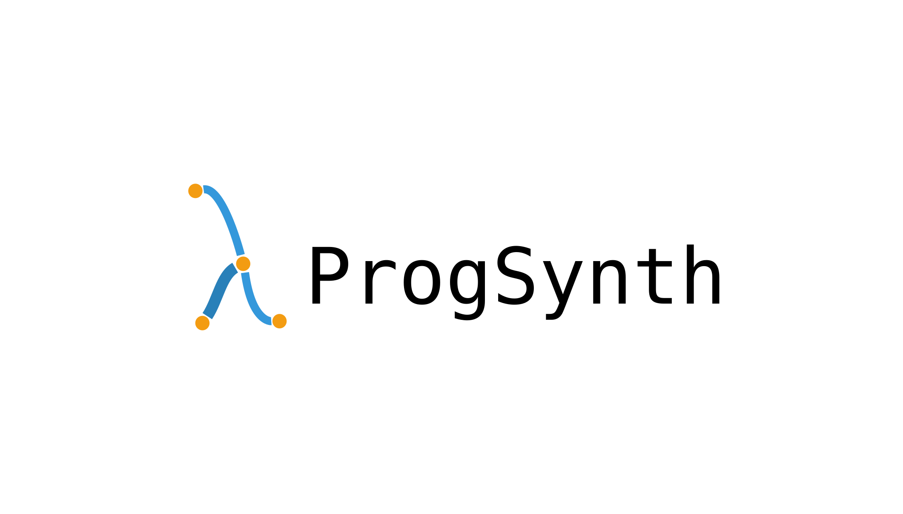

--------------------------------------------------------------------------------
[](https://github.com/nathanael-fijalkow/AutoSynth/actions/workflows/tests.yaml)

ProgSynth is a high-level framework that enables to leverage program synthesis for other domains such as reinforcement learning or system design.

<!-- toc -->

- [More About ProgSynth](#more-about-progsynth)
  - [Combining Deep Learning with Theoretical Guarantees](#combining-deep-learning-with-theoretical-guarantees)
  - [A Scalable Framework](#a-scalable-framework)
- [Installation](#installation)
  - [From Source](#from-source)
    - [Install ProgSynth](#install-progsynth)
- [Documentation](#documentation)
  - [Online](https://nathanael-fijalkow.github.io/ProgSynth/)
  - [Local](#documentation)
- [Troubleshooting](#troubleshooting)
- [Examples](./examples)
- [The Team](#the-team)
- [License](#license)

<!-- tocstop -->

## More About ProgSynth

At a granular level, ProgSynth is a library that consists of the following components:

| Component | Description |
| ---- | --- |
| [**synth**](./synth) | A high level synthesis libary |
| [**synth.generation**](./synth/generation) | A compilation of tools to generate objects needed for the synthesis, it is mainly used with deep learning  |
| [**synth.nn**](./synth/nn) | A library to build neural network with for synthesis  |
| [**synth.pbe**](./synth/pbe) | A library to work in the Programming By Example (PBE) framework |
| [**synth.filter**](./synth/filter) | A library with filtering strategies |
| [**synth.semantic**](./synth/semantic) | A library of program evaluators |
| [**synth.syntax**](./synth/syntax) | A library to manipulate dsl, grammars, probabilistic grammars |
| [**synth.utils**](./synth/utils) | Utility objects and functions that do not fit elsewhere |

Elaborating Further:

### Combining Deep Learning with Theoretical Guarantees

The advantage of "classic" algorithms are their theoretical guarantees.
But many new deep learning based methods have emerged, they provide a tremendous efficiency but lose almost all theoretical guarantees.
ProgSynth provides already implemented algorithms that combine both approaches to get the best of both worlds: speed and guarantees!

### A Scalable Framework

Computing is now done at a large scale in a parallelilized fashion.
As such frameworks should also adapt: they should scale with more computing power but also leverage the power of parallelization.
This was taken into account and this is why for most algorithms we provide, we also provide a way to scale with the number of available processors.

For example, you can split probabilistic grammars into disjoint sub grammars to split the enumeration of the grammar into multiple jobs thus enabling to scale linearly with the numbers of workers.

## Installation

### From Source

If you are installing from source, you will need Python 3.8 or later.

#### Install ProgSynth

ProgSynth can be installed from source with `pip`, `conda` or `poetry`.

```bash
pip install .
```

When using `poetry` in an CUDA environment, then you need to follow every `poetry install` or `poetry update` with:

```bash
pip install torch
```

See this [open issue of poetry](https://github.com/python-poetry/poetry/issues/6409) for more information.

## Documentation

[Online Documentation](https://nathanael-fijalkow.github.io/ProgSynth/)


You might want to generate html pages of the documentation locally, where usage, contribution guidelines and more can be found.
In which case, you will need to use [Sphinx](https://www.sphinx-doc.org/en/master/). 

```bash
pip install sphinx sphinx-rtd-theme myst-parser
```

If Sphinx installation was successful, then use the following command line to generate html pages that you can view by opening the file `docs/build/html/index.html` in your favorite web browser.

```bash
sphinx-build -b html docs/source docs/build/html
```

## Troubleshooting

There are some known issues:

- **seed = 0** is the **same as no seeding**.
- if you get an error after installation try to update/upgrade ``numpy``, it is often due to a discrepancy between the version with which ``vose`` is compiled and the version the environment is running.
- some dependencies may be missing depending on the DSL you want to use, running any example script with -h will list you the list of available DSL with your current installation.

## The Team

ProgSynth is a project initiated by [Nathanaël Fijalkow](https://nathanael-fijalkow.github.io/) and joined by [Théo Matricon](https://theomat.github.io/).
It is based on the [DeepSynth](https://github.com/nathanael-fijalkow/DeepSynth) project of [Nathanaël Fijalkow](https://nathanael-fijalkow.github.io/), [Guillaume Lagarde](https://guillaume-lagarde.github.io/), [Théo Matricon](https://theomat.github.io/), [Kevin Ellis](https://www.cs.cornell.edu/~ellisk/), [Pierre Ohlmann](https://www.irif.fr/~ohlmann/), Akarsh Potta

Former:

- (2023) [Félix Yvonnet](https://github.com/Felix-Yvonnet) did a 2 months internship to work on restarts, a future feature of ProgSynth.
- (2023) [Priscilla Tissot](https://fr.linkedin.com/in/priscilla-tissot-9493851b8) did a 7 weeks long internship working on the Carel neural network and trying to improve the performance of our prediction models.
- (2022) [Gaëtan Margueritte](https://github.com/gaetanmargueritte) did a four-month internship. He created the regexp and transduction DSLs, the first tutorial and first drafts of code related to the use of user defined constants.
- (2022) Utkarsh Rajan did a two-month internship. He contributed to the implementation of bucket search and worked on the tower DSL.

## License

ProgSynth has a MIT license, as found in the [LICENSE](LICENSE.md) file.
